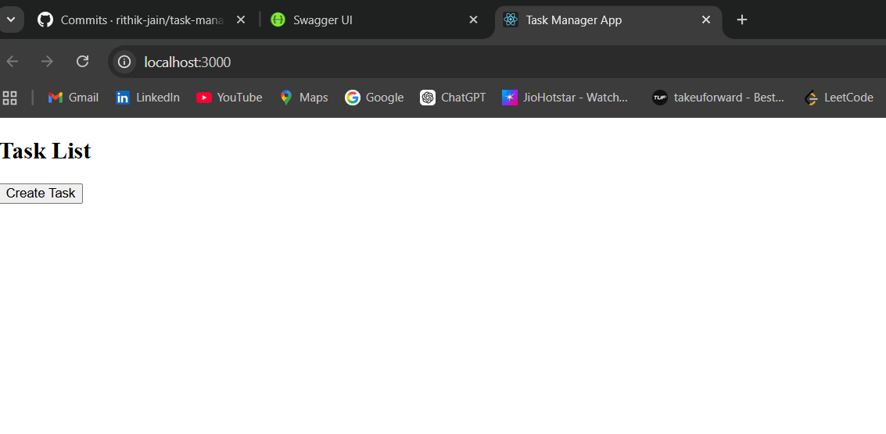
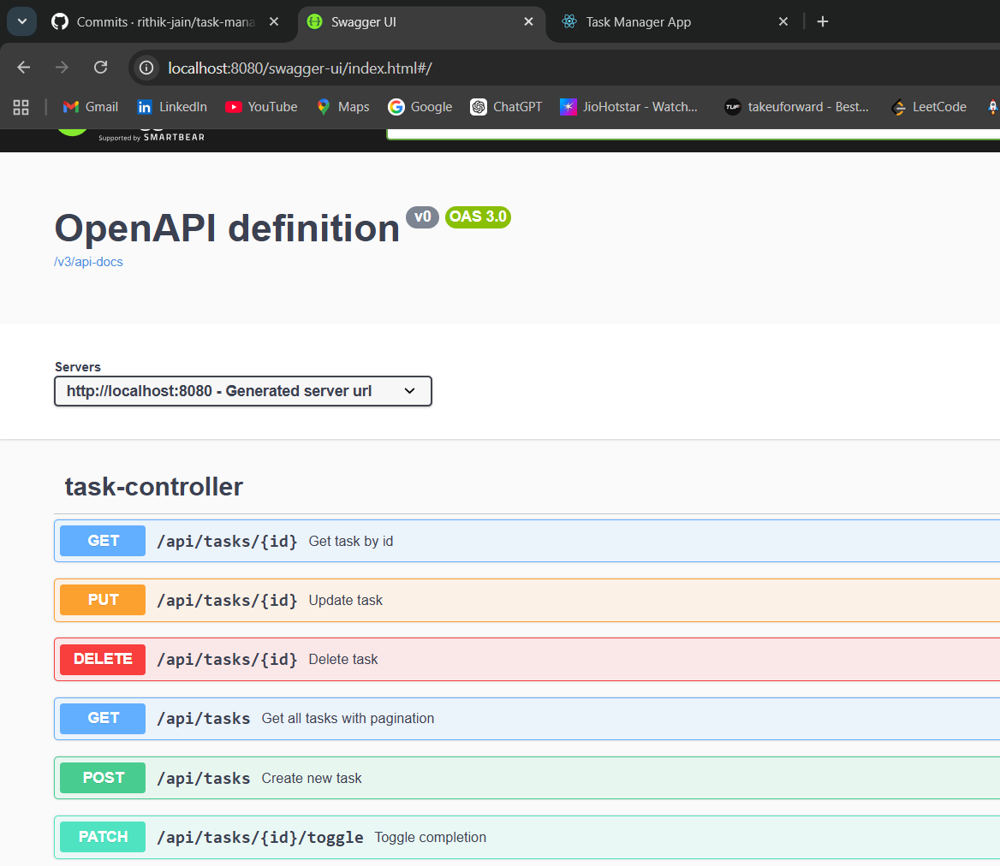
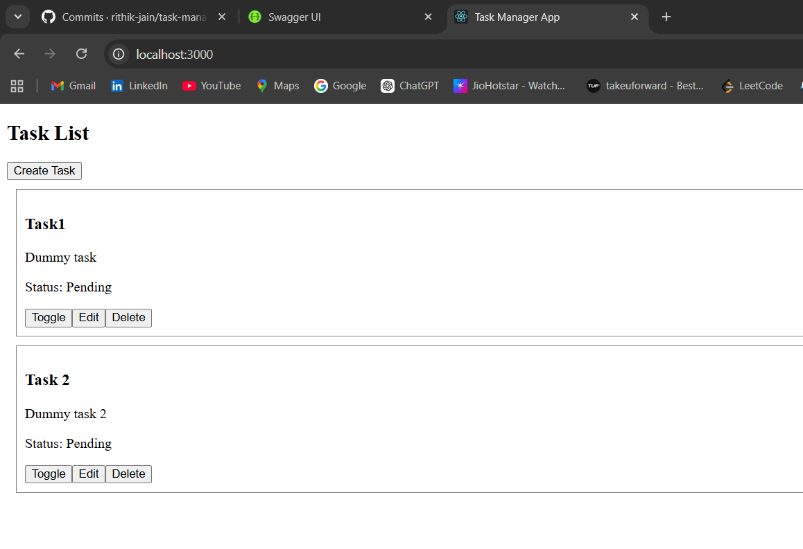
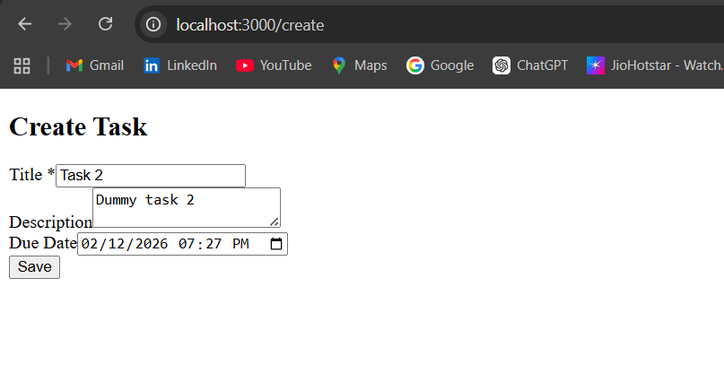
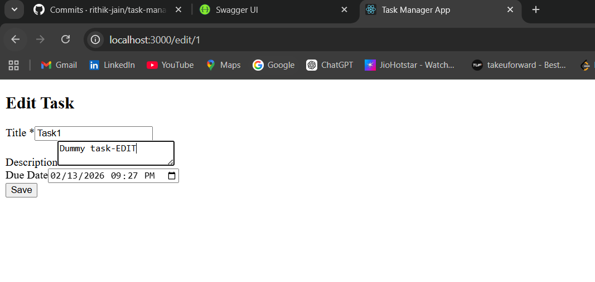
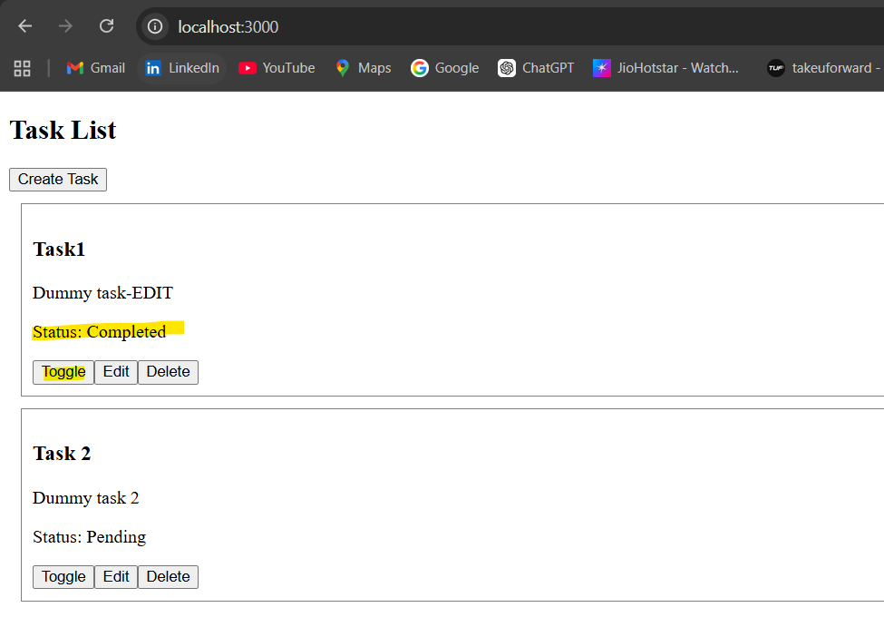

# Task Management Application

A full-stack Task Management Application built with:

- **Backend**: Spring Boot (Java 21, Gradle, JPA, H2, Swagger) (IntelliJ editor)
- **Frontend**: React + TypeScript (Axios, React Router) (VS code editor)

This application allows users to create, update, delete, and manage tasks with pagination and filtering support.

---

# Project Structure
# Task Management Application

A full-stack Task Management Application built with:

- **Backend**: Spring Boot (Java 17, Gradle, JPA, H2, Swagger)
- **Frontend**: React + TypeScript (Axios, React Router)

This application allows users to create, update, delete, and manage tasks with pagination and filtering support.

---

# Project Structure
task-management-app/
│
├── backend/ # Spring Boot application
└── frontend/ # React TypeScript SPA

---

# Features
## Backend Features

- Create Task
- Get All Tasks (with pagination)
- Filter by completion status
- Get Task by ID
- Update Task
- Delete Task
- Toggle completion
- H2 In-Memory Database
- Swagger API Documentation
- Logging (SLF4J)
- Service Layer validation
- Unit Test for Service

## Frontend Features

- Task List Page
- Create Task Page
- Edit Task Page
- Toggle completion from list
- Delete task
- React Router navigation
- Axios API integration
- TypeScript interfaces

---

# Tech Stack

## Backend

- Java 21
- Spring Boot 3
- Spring Data JPA
- H2 Database
- Gradle
- Springdoc OpenAPI (Swagger)
- SLF4J Logging

## Frontend

- React
- TypeScript
- Axios
- React Router DOM

---

# Backend Setup

## 1️. Prerequisites

- Java 21
- Gradle (or use Gradle wrapper)
- VS Code or IntelliJ

Verify Java:
java -version

---

## 2. Navigate to Backend Folder

cd backend

---

## 3️. Run the Application

Mac/Linux:
./gradlew bootRun

Windows:
gradlew.bat bootRun

Application will start at:
http://localhost:8080
---

## 4️. Swagger UI

Open:
http://localhost:8080/swagger-ui.html

OpenAPI JSON:
http://localhost:8080/v3/api-docs
---

## 5️. H2 Database Console
http://localhost:8080/h2-console

JDBC URL:
jdbc:h2:mem:taskdb

---

# Backend API Endpoints

Base URL:
http://localhost:8080/api/tasks

### Create Task
POST /api/tasks

### Get All Tasks
GET /api/tasks?page=0&size=10

Optional filter:
GET /api/tasks?isCompleted=true

### Get Task By ID
GET /api/tasks/{id}

### Update Task
PUT /api/tasks/{id}

### Toggle Completion
PATCH /api/tasks/{id}/toggle

### Delete Task
DELETE /api/tasks/{id}

---

# Run Backend Tests
./gradlew test

---

# Frontend Setup

## 1️. Prerequisites

- Node 18+ (recommended)
- npm or yarn

Verify Node:
node -v

---

## 2️. Navigate to Frontend Folder

cd frontend

---

## 3️. Install Dependencies

npm install

---

## 4️. Start Frontend

npm start

Frontend runs at:
http://localhost:3000

---

# Full Application Run Order
## Terminal 1 (Backend)

cd backend
./gradlew bootRun

### Terminal 2 (Frontend)

cd frontend
npm start

Open browser:
http://localhost:3000

---

#  Design Decisions

- Clean layered backend architecture (Controller → Service → Repository)
- Manual validation in Service layer
- Controller-level exception handling
- RESTful API design
- Pagination via Spring Pageable
- React SPA with client-side routing
- Axios for API communication
- TypeScript for type safety
- Logging using SLF4J

---

# 🔐 Security Considerations (Future Enhancements)

- JWT-based authentication
- Role-based access control
- CSRF protection
- HTTPS enforcement

---

# 📈 Future Improvements

- PostgreSQL instead of H2
- Dockerization
- CI/CD pipeline
- DTO layer separation
- Caching (Redis)
- Advanced filtering (date range, keyword search)
- Better UI interface wiht login support and use of colors.
- Material UI integration

---

# Decisions Taken

- Used a layered architecture (Controller → Service → Repository) to keep responsibilities clear and avoid mixing business logic inside controllers.

- Handled validation inside the service layer instead of relying only on annotations, so business rules are enforced consistently.

- Implemented explicit error handling in controllers and returned proper HTTP status codes (201, 200, 400, 404, 204) to follow REST best practices.

- Added pagination using Spring Pageable to prevent loading large datasets into memory and to make the API scalable from day one.

- Added server-side filtering (isCompleted) to reduce unnecessary data transfer and keep the API efficient.

- Integrated Swagger (OpenAPI) to make the API self-documenting and easier to test and integrate.

- Added structured logging (SLF4J) in controller and service layers to make debugging and production monitoring easier.

- Used H2 database for development to simplify setup and avoid environment dependency during local development.

- Separated frontend concerns by using a centralized API layer (taskApi.ts) and TypeScript interfaces for better maintainability and type safety.

- Avoided overengineering by keeping the design simple, clean, and extensible without introducing unnecessary abstractions.

---

## Screenshots

---

#  Author
Rithik Jain - rithikjain06@gmail.com

---

# 📜 License

This project is for demonstration as part of Coderbyte assessment